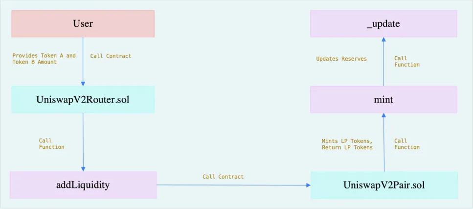

# Uniswap-v2-08

UniswapV2 当中，允许流动性提供者为任意两个 ERC-20 代币创建交易对合约。
UniswapV2 中不直接支持 ETH，用户在使用交易对前必须先将 ETH 转换成 WETH。实际上，UniswapV2 内部自动将用户提供的 ETH 转换为 WETH，这样简化了用户的操作，让他们无需手动转换 ETH 为 WETH。

## 源码解析

### 添加流动性

用户在添加流动性的时候，用户首先调用 UniswapV2Router.sol 合约，提供 Token A 和 Token B 的数量，UniswapV2Router.sol 合约的 addLiquidity 函数接收用户的请求并进行处理。

addLiquidity 函数进一步调用 UniswapV2Pair.sol 合约，在 UniswapV2Pair.sol 合约中，调用 mint 函数执行实际的流动性添加操作，mint 函数根据用户提供的 Token A 和 Token B 的数量，计算应铸造的流动性代币（LP 代币）的数量，并将这些 LP 代币分配给用户，流动性添加操作完成后，mint 函数调用 _update 函数更新储备量。

