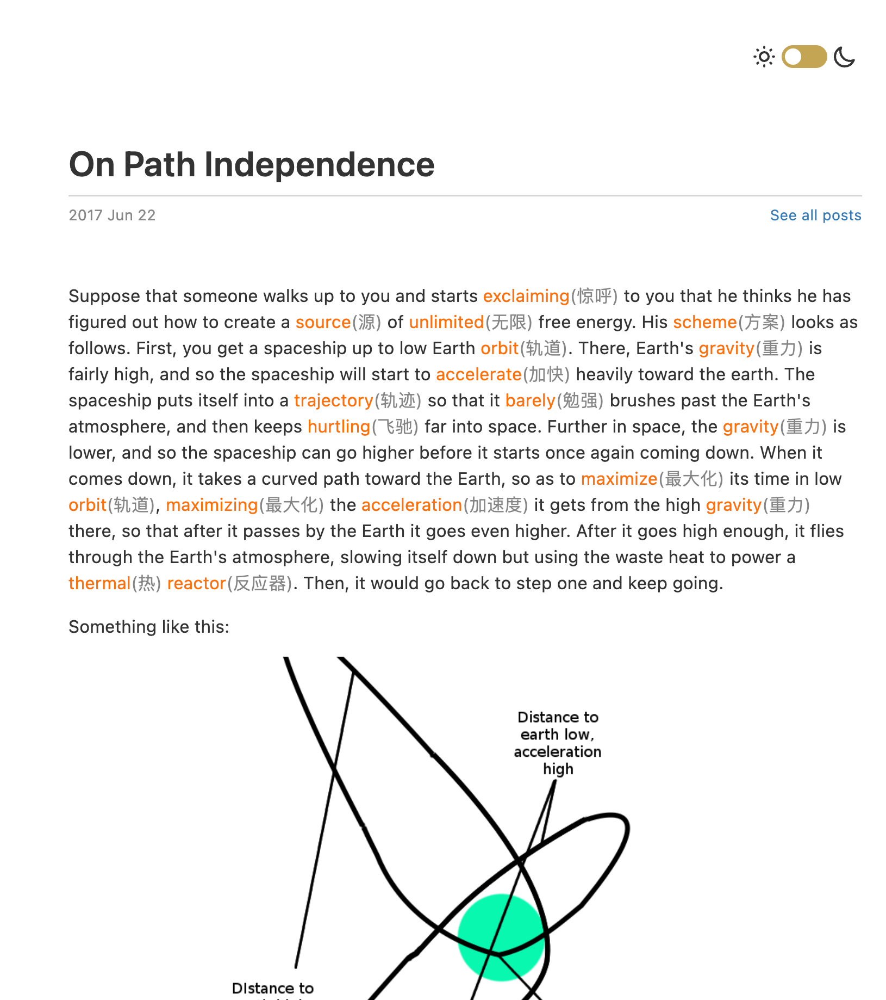
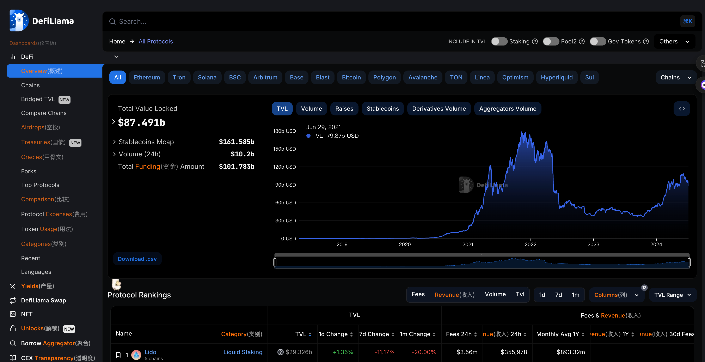
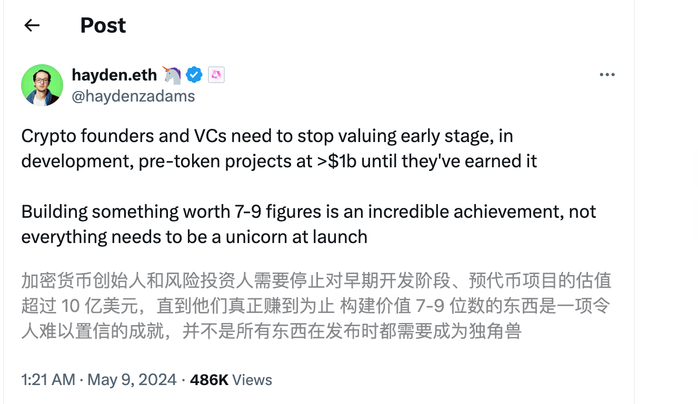
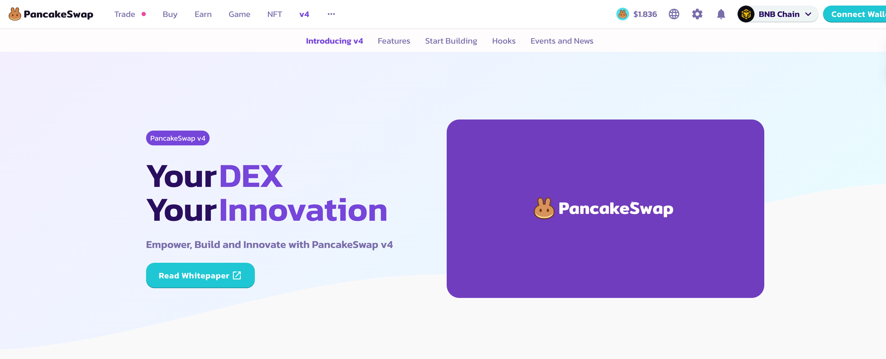

# Uniswap

## Uniswap 的诞生

Uniswap 是一种基于以太坊的去中心化交易所（DEX），它的诞生标志着去中心化金融（DeFi）领域的重要发展。以下是 Uniswap 诞生和发展的简要历程：

### 背景

1. **创始人**：Uniswap 的创始人是 Hayden Adams，他曾是一名机械工程师。2017 年，他在听到 Vitalik Buterin（以太坊的联合创始人）关于自动化市场做市商（AMM）的想法后，决定投入到去中心化交易所的开发中。
2. **灵感来源**：Uniswap 的核心理念来自于 Vitalik Buterin 提出的 AMM 概念，这是一种利用数学公式来确定资产价格的机制，而非依赖于传统的订单簿。

### 发展历程

1. **Uniswap V1**：Uniswap 的第一个版本于 2018 年 11 月正式上线。它通过智能合约实现了自动化的交易和流动性提供，允许用户在无需信任中间方的情况下进行代币交易。
2. **Uniswap V2**：2020 年 5 月，Uniswap 发布了第二个版本，增加了多项重要功能，包括：
   - 支持任意 ERC-20 代币对交易。
   - 改进的价格预言机。
   - 闪电交换功能。
3. **Uniswap V3**：2021 年 5 月，Uniswap 推出了第三个版本，进一步优化了流动性提供的效率和灵活性，引入了集中的流动性（concentrated liquidity）和多级费用结构。

### 影响与意义

- **去中心化交易**：Uniswap 的成功表明，去中心化的交易平台可以有效地运行，并在许多方面优于传统的中心化交易所，如安全性和隐私性。
- **流动性挖矿**：Uniswap 的流动性提供机制激发了流动性挖矿的兴起，吸引了大量用户参与到 DeFi 生态系统中。
- **行业标准**：Uniswap 的设计和技术影响了许多其他去中心化交易所的开发，成为行业的标杆。

### 持续发展

Uniswap 团队和社区不断致力于改进和扩展其平台，以应对 DeFi 领域不断变化的需求和挑战。随着 DeFi 生态系统的进一步发展，Uniswap 仍将在其中扮演重要角色。

### Uniswap 的诞生记

#### 2017年6月22日 Vitalik 发表文章《 On Path Independence》

<https://vitalik.eth.limo/general/2017/06/22/marketmakers.html>

#### 2017年7月6日，Hayden Adams 被西门子解雇，朋友 karl Floersch 劝说其关注以太坊并学习智能合约的开发

#### 2018年11月2日，Uniswap V1 部署到以太坊主网

## Uniswap V1

- 2018年11月2日 发布
- 使用 Vyper 语言编写
- 仅支持ERC20-ETH 直接互换或者通过 ETH 进行互换
- 合约地址：<https://github.com/Uniswap/v1-contracts>

Uniswap V1 是 Uniswap 协议的第一个版本，于2018年11月上线。它开创了一种新型的去中心化交易模式，利用自动化做市商（AMM）机制来实现去中心化的代币交换。以下是 Uniswap V1 的主要特点和运行机制：

### 主要特点

1. **自动化做市商（AMM）模型**：
   - Uniswap V1 使用恒定乘积公式 \( x \times y = k \)，其中 \( x \) 和 \( y \) 分别代表两种不同代币的储备量，而 \( k \) 是一个常数。这一公式确保了代币储备的乘积在每次交易后保持不变。

2. **去中心化与无需信任**：
   - Uniswap V1 完全去中心化，所有交易都通过智能合约自动执行，无需第三方中介。
   - 用户无需信任任何中介，可以直接在链上进行交易。

3. **流动性池**：
   - Uniswap V1 引入了流动性池（Liquidity Pools）的概念。用户可以将等值的两种代币存入流动性池，成为流动性提供者（LP）。在提供流动性时，LP 会获得流动性代币，代表其在池中的份额。
   - 流动性提供者根据其在池中的份额，从每笔交易中获得一定比例的交易费用（通常为 0.3%）。

4. **简化的用户体验**：
   - 用户无需创建账户或进行身份验证，可以直接使用以太坊钱包（如 MetaMask）进行交易。
   - 用户界面设计简洁，易于操作。

### 运行机制

1. **交易过程**：
   - 当用户在 Uniswap V1 上进行交易时，智能合约会根据当前流动性池中的代币储备量和恒定乘积公式计算出交易价格。
   - 用户提交的代币会被添加到流动性池中，并从池中取出相应数量的目标代币。

2. **价格计算**：
   - Uniswap V1 的价格由池中代币的比例决定。例如，如果一个池中有大量的 ETH 和少量的 DAI，买入 DAI 的价格将相对较高，反之亦然。这种机制鼓励市场趋于平衡。

3. **流动性提供者收益**：
   - 流动性提供者通过交易费用获得收益。每笔交易收取的 0.3% 费用会按比例分配给所有流动性提供者。

### 影响与意义

1. **去中心化金融（DeFi）革命**：
   - Uniswap V1 是 DeFi 领域的重要突破，证明了去中心化交易所可以在无需中介的情况下高效运行。

2. **流动性挖矿的兴起**：
   - Uniswap 的流动性提供机制吸引了大量用户参与，为 DeFi 生态系统注入了活力。

3. **行业标准**：
   - Uniswap V1 的成功为其他去中心化交易所和 AMM 模型树立了标杆，推动了整个 DeFi 行业的发展。

Uniswap V1 的推出标志着去中心化交易的一大进步，为后续版本的改进和其他 DeFi 项目的创新奠定了基础。

### Uniswap V1 里面的 Swap

在 Uniswap V1 中，直接交换 ETH 是不可能的，因为 Uniswap V1 仅支持 ERC-20 代币之间的交换。然而，为了解决这一问题，Uniswap V1 使用了一种称为 WETH（Wrapped Ether）的代币。

## Uniswap V2

- 2020年5月发布
- 增加 ERC20-ERC20 直接互换
- 增加 Flash Swap
- 增加 Oracle
- 改进手续费收取方式
- 引爆了 Defi 赛道
- 2020年9月发行了治理代币 UNI

不在Swap的时候收取手续费，只在添加和移除流动性的时候收取手续费

<https://defillama.com/>

<https://www.sushi.com/swap>

Uniswap 的 UNI 代币是其治理代币，于 2020 年 9 月 16 日推出。UNI 代币的引入标志着 Uniswap 从一个去中心化的交易协议发展为一个社区驱动的自治组织。以下是关于 UNI 代币的详细介绍：

### UNI 代币的背景与发行

1. **引入背景**：
   - UNI 代币的引入是为了促进 Uniswap 的去中心化治理，赋予社区成员对协议进行提案和投票的权力。
   - 这一举措旨在让 Uniswap 协议的发展和管理更加透明和民主。

2. **发行数量**：
   - 初始总供应量：1,000,000,000 UNI。
   - 四年内逐步释放：所有 UNI 代币将在四年内逐步释放。

3. **分配机制**：
   - 社区成员：60.00%（6 亿 UNI），分配给 Uniswap 社区成员，包括流动性提供者、用户和 SOCKS 持有者。
   - 团队成员和未来员工：21.51%（2.15 亿 UNI）。
   - 投资者：17.80%（1.78 亿 UNI）。
   - 顾问：0.69%（690 万 UNI）。

### 主要功能

1. **治理权利**：
   - UNI 持有者可以提出和投票通过协议的改进提案（Uniswap Improvement Proposals，UIPs）。
   - 这些提案可能涉及协议参数的调整、流动性激励计划的更改、资金的分配等。

2. **流动性激励**：
   - 一部分 UNI 代币被分配用于激励流动性提供者，鼓励他们为 Uniswap 提供流动性。
   - 这些激励措施有助于维持协议的活跃和高效运行。

3. **生态系统基金**：
   - 一部分 UNI 代币被分配用于资助 Uniswap 生态系统的发展，包括开发者奖励、社区项目资助等。

### 发行后的影响

1. **去中心化治理**：
   - UNI 代币的引入极大地促进了 Uniswap 的去中心化治理，使得协议的发展方向由社区共同决定。
   - 通过 UNI 代币，社区成员能够参与协议的管理和决策，提升了协议的透明度和民主性。

2. **流动性提供**：
   - UNI 代币的流动性激励措施吸引了大量流动性提供者，为 Uniswap 提供了充足的流动性。
   - 这使得 Uniswap 能够提供更好的交易体验和更低的滑点。

3. **生态系统发展**：
   - UNI 代币为 Uniswap 生态系统的发展提供了资金支持，促进了更多创新项目和工具的开发。
   - 这些项目和工具进一步增强了 Uniswap 的功能和用户体验。

### 总结

Uniswap 的 UNI 代币是其治理和激励机制的重要组成部分。通过 UNI 代币，Uniswap 实现了去中心化治理，使得社区成员能够参与协议的发展和管理。同时，UNI 代币的流动性激励措施吸引了大量流动性提供者，增强了协议的流动性和交易体验。UNI 代币的引入不仅提升了 Uniswap 的透明度和民主性，还为其生态系统的发展提供了强有力的支持。

Direct Swap

Swap Through ETH

Custom Path

### Uniswap V2 的核心合约

- Uniswap V2 Core
  - UniswapV2Pair.sol
  - UniswapV2Factory.sol
- Uniswap V2 Periphery
  - Router contract
  - Library contract

<https://github.com/Uniswap/v2-core>

<https://github.com/Uniswap/v2-periphery>

### Uniswap vs SushiSwap

- 2020年8月28日，SushiSwap 发布
- SushiSwap fork 了 Uniswap，并且做了一些改进
- SushiSwap 增加了奖励系统，从 Uniswap 吸引了许多流动性
- 作为回击，2020年9月 Uniswap 宣布发行 UNI 作为治理代币

## Uniswap V3

- 2021年5月，Uniswap V3 发布
- 主要特性：
  - 增加集中流动性
  - 优化手续费设置
  - LPT 改成基于 NFT 的 Liquidity Token
  - 改进开源协议

两年的技术保护期

## Uniswap V4

- 2023年6月23日发布代码草案
- 新增主要特性：
  - Hook
  - Singleton Pool Manager Design
  - Reintroduction of Native ETH
  - Flash Accounting
- 目标：更快、更省 gas fee，容易集成，成为DeFi 领域的基础设施

#### 有意思的思考

<https://pancakeswap.finance/v4>

## Uniswap vs Binance

- 无须实名认证
- 代码开源
- 上币不收费
- 用户自己管理资金，不用托管到交易所
- 社区治理
