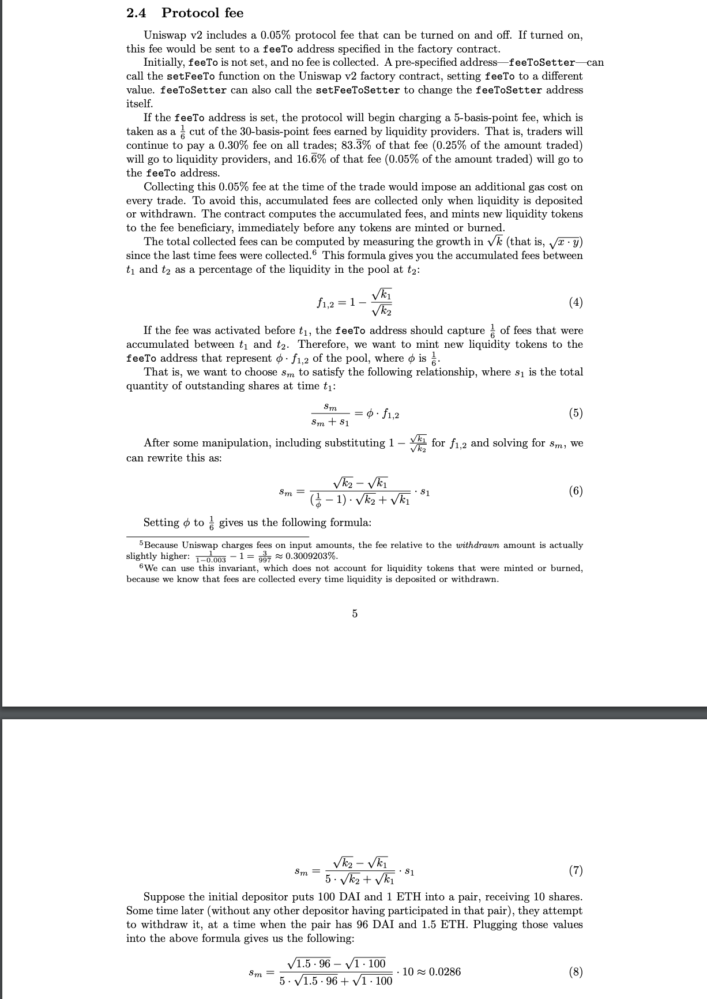
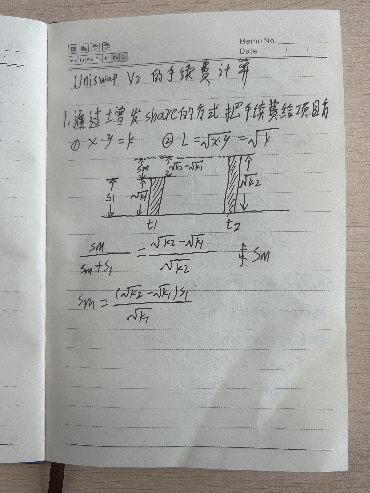
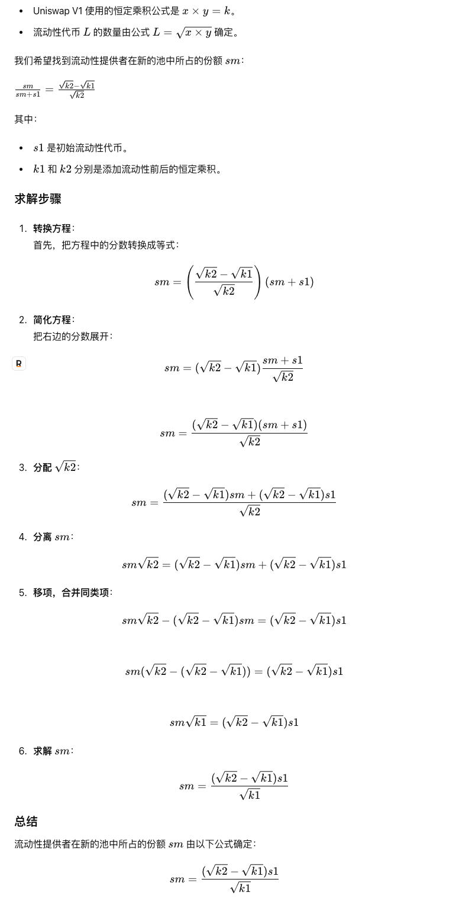
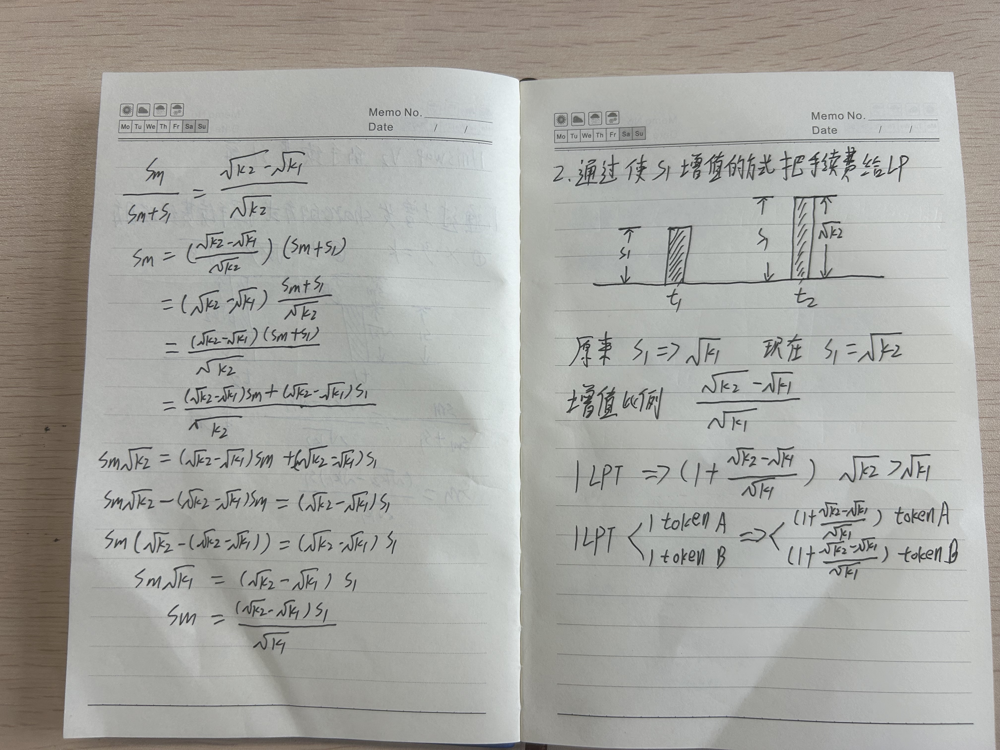
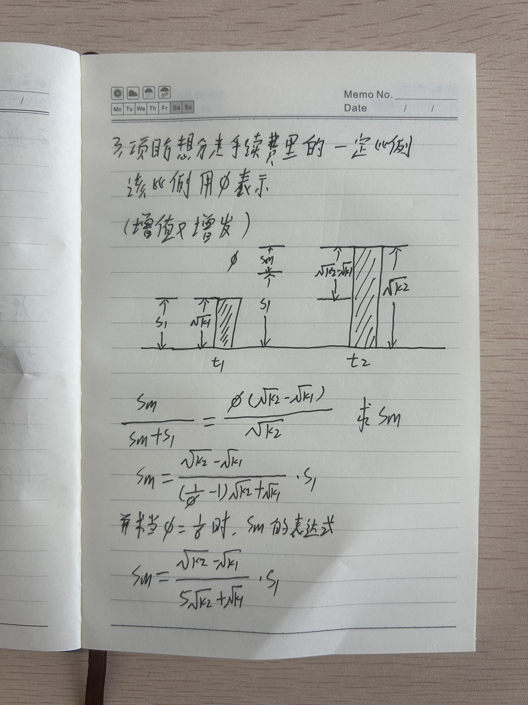
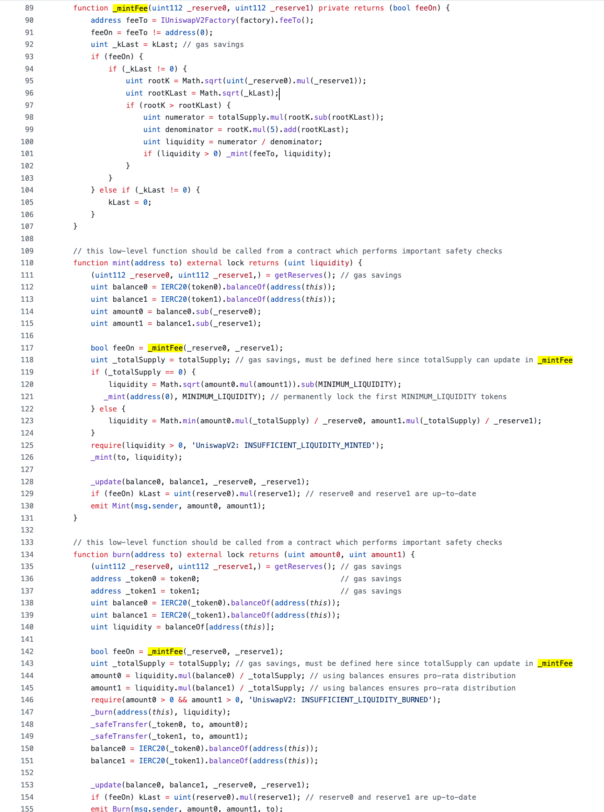

# Web3学习之Uniswap V2 的手续费计算

## Uniswap V2 的手续费计算

Uniswap协议针对每笔交易收取0.05%的手续费（即0.3%的1/6）。该手续费默认关闭，但是可以在未来被打开，在打开后流动性提供者将只能获取0.25%手续费，而非0.3%，因为其中0.05%分给协议。

也就是说，Uniswap v2 包含 0.05% 的协议费用，可以打开或关闭。如果打开，此费用将发送到工厂合约中指定的 feeTo 地址。

最初，feeTo 未设置，不收取任何费用。通过预先指定的地址——feeToSetter——可以调用 Uniswap v2 工厂合约上的 setFeeTo 函数，将 feeTo 设置为不同的值。feeToSetter 还可以调用 setFeeToSetter 来更改 feeToSetter 地址本身。

如果设置了 feeTo 地址，协议将开始收取 5 个基点的费用，这是流动性提供者赚取的 30 个基点费用的 1/6 倍。也就是说，交易者将继续为所有交易支付 0.30% 的费用；该费用的 83.3%（交易金额的 0.25%）将归于流动性提供者，而该费用的 16.6%（交易金额的 0.05%）将归于 feeTo 地址。

在交易时收取这 0.05% 的费用将对每笔交易产生额外的 gas 成本。为了避免这种情况，只有在存入或提取流动性时才会收取累积费用。合约计算累积费用，并在任何代币被铸造或销毁之前立即向费用受益人铸造新的流动性代币。

<https://github.com/Fankouzu/my-uniswap-v2-core/blob/master/WhitepaperCN.pdf>

<https://uniswap.org/whitepaper.pdf>

### Uniswap V2 的手续费计算过程

#### 第一种情况

#### 公式推导

#### 第二种情况

第三种情况（实际使用的）

## 代码中的实现

<https://github.com/Uniswap/v2-core/blob/master/contracts/UniswapV2Pair.sol>

<https://www.rareskills.io/post/uniswap-v2-mintfee>

<https://static.wixstatic.com/media/935a00_dc3d8ea8db88403aadba4d2ee1c48d05~mv2.png>

