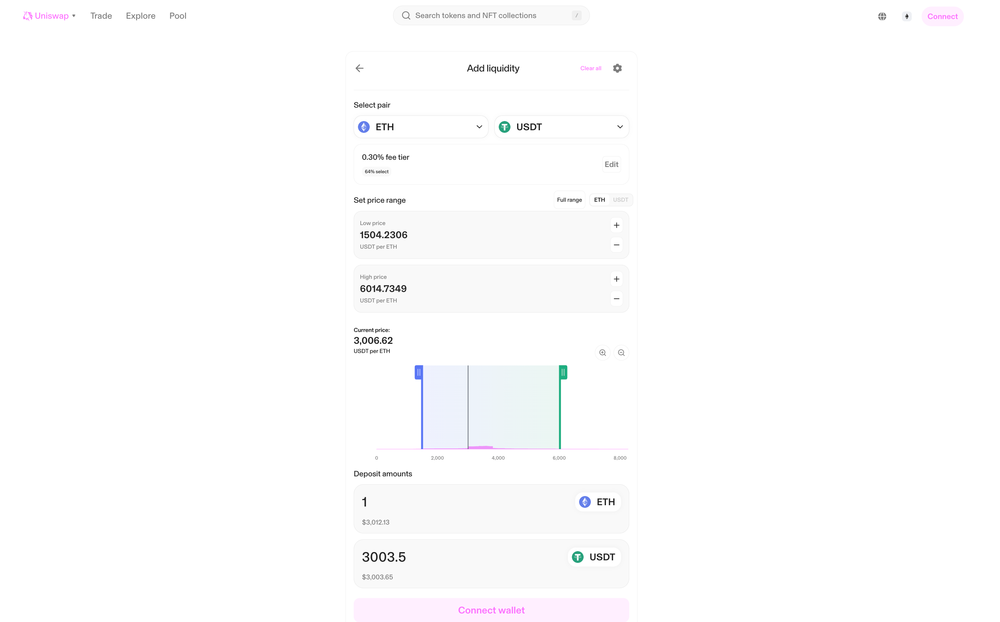

# Web3学习之去中心化交易所(DEX)

## 去中心化交易所(DEX)

稳定币、交易所、借贷是DeFi 领域的三大支柱

### 交易所

- 证券交易所
- 期货交易所
- 加密资产交易所
  - 中心化交易所
  - 去中心化交易所

区块链中的交易所指的是加密资产交易所

中心化交易所排名

#### Top加密货币现货交易所

<https://coinmarketcap.com/rankings/exchanges/>

#### Top加密货币去中心化交易所

<https://coinmarketcap.com/rankings/exchanges/dex/?type=spot>

#### 最热门的加密货币

- <https://coinmarketcap.com/trending-cryptocurrencies/>

### 中心化交易所的业务模式——以币安为例

- 交易费：交易所通过提供买卖加密货币的平台来收取交易费用。有些交易所还提供高级交易选项，如杠杆交易，这通常会带来更高的费用
- 上币费：项目方团队后面都会去找交易所上币，但是上币是需要缴纳一笔数额不小的上币费
- 量化交易：用户在交易所中，一般数字资产币都是暂时存放在交易所，基本上交易所掌握所有筹码可以选择做多或者做空，交易所可以去赚取差价，而且用户提币出去也可以赚取手续费
- 原生代币

#### 火币出售  

李林 孙宇晨

币安 赵长鹏  何一

### 中心化交易所的交易模式——订单簿模式

- 中央限价订单簿（CLOB）就是一本由出价和报价组成的权限透明账本，从最好价开始依次排序（两边分别是参与者愿意买/卖的价格）
- 所有的参与者都能看到所有的报价和出价，他们也可以参与其中
- 订单簿中两边的第一行，即是最好的报价/出价

### 订单簿模式的优劣

#### 优势

- 透明的流动性
- 做市商可自由出入
- 做市商可以自由决定价格与数量

#### 劣势

- 冷启动问题（很难给出初始流动性）
- 对非流动性资产不利
- 如果是链上交易所，则对链的TPS要求很高

### 中心化交易所的风险：FTX 崩盘始末

中心化交易所（CEX）虽然提供了便捷的加密货币交易服务，但也面临许多风险，FTX 交易所的崩盘事件是这些风险的一个典型例子。以下是关于中心化交易所的风险以及 FTX 崩盘始末的详细解释。

#### 中心化交易所的风险

1. **托管风险**：用户的资产由交易所托管，交易所持有用户的私钥，这意味着如果交易所被黑客攻击或内部管理不善，用户的资产可能面临损失。

2. **操作风险**：交易所可能因为内部操作失误、管理不善或道德风险导致用户资产损失。

3. **流动性风险**：如果交易所缺乏足够的流动性，用户可能无法及时交易，或者在市场波动时难以迅速反应。

4. **合规风险**：中心化交易所需要遵守各国的法律法规。若交易所未能合规，可能面临罚款、资产冻结甚至关闭。

5. **透明度问题**：中心化交易所的运营和财务情况往往不透明，用户难以了解其实际运营状况。

#### FTX 崩盘始末

FTX 是一家知名的加密货币交易所，由 Sam Bankman-Fried 创建，于 2022 年因一系列事件导致崩盘。以下是这一事件的关键点：

1. **快速崛起**：FTX 迅速成长为全球领先的加密货币交易所之一，提供广泛的交易产品和服务，并受到广泛认可。

2. **财务问题**：2022 年初，有传闻指出 FTX 及其关联公司 Alameda Research 存在严重的财务问题和管理不善。随后，FTX 的财务状况成为市场关注的焦点。

3. **用户恐慌**：随着财务问题的传闻扩散，用户开始担心其在 FTX 上的资产安全，导致大量用户提款。FTX 面临流动性危机，无法满足用户的提款需求。

4. **内部挪用**：进一步的调查揭示，FTX 和 Alameda Research 之间存在不透明的资金转移，涉及用户资金的挪用，进一步加剧了市场对 FTX 的信任危机。

5. **交易所崩盘**：随着提款压力增加，FTX 最终无法维持运营，于 2022 年 11 月申请破产。数十亿美元的用户资产被冻结，导致大量用户蒙受损失。

6. **法律后果**：FTX 的崩盘引发了全球范围内的法律和监管调查，其创始人 Sam Bankman-Fried 及其他高管面临法律诉讼和刑事指控。

#### 教训与反思

1. **加强监管**：FTX 崩盘事件表明，加密货币市场需要更严格的监管措施，确保交易所的财务透明度和用户资产的安全。

2. **分散风险**：用户应避免将所有资产存放在单一交易所，采用多种存储方式（如冷钱包和多家交易所）分散风险。

3. **尽职调查**：在选择交易所时，用户应进行尽职调查，选择具有良好信誉和透明度的交易所。

4. **提高警惕**：用户应时刻关注市场动态和交易所的运营情况，及时应对潜在风险。

FTX 事件提醒我们，在享受加密货币交易便捷性的同时，必须高度重视风险管理和资产安全。

### 链上交易方案：自动做市商

去中心化交易所一般不会选择使用订单簿的模式，因为订单簿的模式对链上的TPS要求太高。

- 出现原因：以太坊的TPS 对于支撑链上订单簿的实时更新来说太低了。反面案例：Solana 链由于其 60K 的TPS，所以上面有很多订单簿模式的交易所。
- 交易所里没有订单簿，只有一系列预设的函数，为各类货币的互相交换来定价。
- 这些预设的函数（例如 `x * y = k`）基于两头货币在各自流动性池中的供给变化率，来设定价格。在某个货币的流动性池内，任何人都能够提供该种货币以增加其流动性，从而获得收益。

### CPAMM：Constant Product Auto Market Maker

- 基础公式：`x * y = k`
- `Liquidity Provider(LP) 与 Liquidity Provider Token(LPT)`
- LPT 数量 `s = sqrt(x * y)`

- 初始流动性确定价格

只要有价差，就一定会有套利空间，有套利空间的话，一定会被机器人吃掉。

做区块链项目一定不要一厢情愿，市场上有无数的机器人，只要有价差，就一定会被套利

### Dex 的去中心性

- 任何人都可以添加流动性，成为 LP 并拿到 LP Token
- LP 在任意时间可以移除流动性并销毁LP Token，拿回自己添加的 Token
- 用户可以使用非官方的前端页面来进行交易
- 交易时收取一定手续费，并且分配给 LPT Holder

### 自动化做市模式的优劣

#### 自动化做市模式的优势

- 对于新的代币，可以很方便的冷启动
- 去中心化
- 代币交换可组合性很高

#### 自动化做市模式的劣势

- 所有价格点的统一流动性（在 Uniswap V3 中已解决）
- 滑点频繁
- 波动性大，经常有很大的临时亏损（流动性提供者在平均表现上是盈利的）

### CPAMM 里的数学

起始状态：`x * y = k`

- 添加流动性 `Add liquidity`
  - `(x + △x) * (y + △y) = k1` 其中 `△x / △y = x / y，k1 > k`
- 交易 Swap
  - `(x - △x) * (y + △y) = k` 或 `(x + △x) * (y - △y)`
- 移除流动性 `Remove liquidity`
  - `(x - △x) * (y - △y) = k2` 其中  `△x / △y = x / y，k2 < k`

<https://app.uniswap.org/swap?lng=en-US>

#### Swap

#### 添加流动性

### CPAMM 公式推导详解

#### Swap

#### 添加流动性、移除流动性

#### 计算S

#### 推导公式一

#### 推导公式二

#### 滑点

